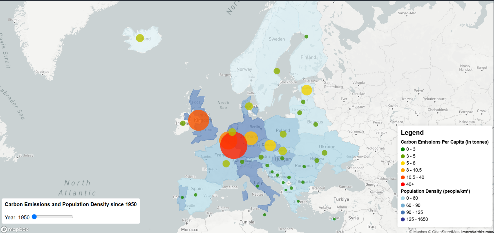
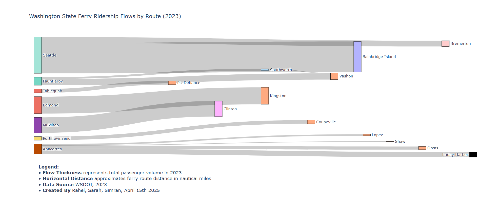
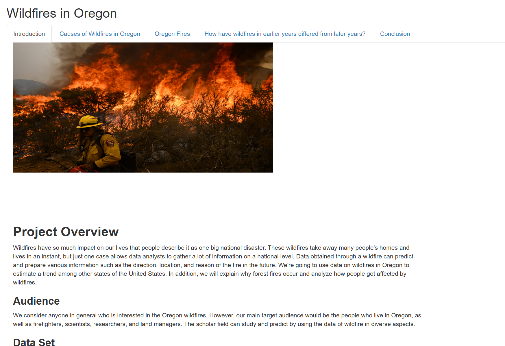
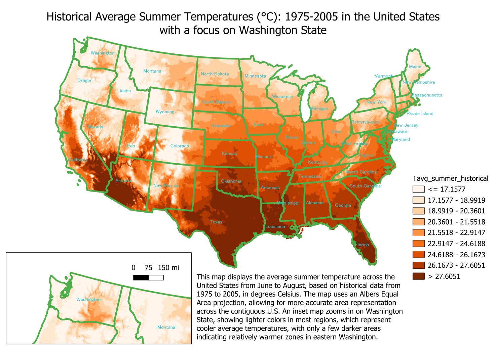

Hello! I'm Simran, a recent graduate from the University of Washington with a B.A. in [Geography–Data Science](https://geography.washington.edu/ba-geography-data-science-option) and a minor in South Asian Studies. I specialized in multiple programs within GIS and data science like R, QGIS, ArcGIS Online, and Web GIS. 

## Featured Projects

### ArcGIS Online Story Maps:
- **Partition of British India**  
  [View StoryMap](https://storymaps.arcgis.com/stories/c3329ef58d574ae6a680a25ed86ff879)  
  Historical mapping and personal reflection on migration and borders.

- **History of the Bhatti Name**  
  [View StoryMap](https://storymaps.arcgis.com/stories/4785f88154d14645bb93e145a8d6e696)  
  Genealogical mapping across regions and generations.

### Web GIS – Carbon Emissions in Europe

- Built with HTML, JavaScript, and SQL  
- Features interactive time slider, emissions gradients, and popups  
- Designed for public and policymaker engagement  
  [View GitHub Repo](https://github.com/simmi333/GIS-Work/tree/main/EuropeCarbon)

### ArcGIS Pro  – Drinking Water Systems & Buffer Zones

- Created in ArcGIS Pro using public data from the [Washington Department of Health](https://geo.wa.gov/datasets/WADOH::drinking-water-systems/explore)
- Mapped drinking water systems across Snohomish County and applied a 500-meter buffer analysis.
- Styled water systems by operational status (active, inactive) using unique symbology.
- Designed a professional layout with legend, scale bar, north arrow, and descriptive text.

### Python - Ferry Ridership Flow Visualization 

- Sankey diagram of Puget Sound ferry routes  
- Processed WSDOT data to visualize passenger flows  
[View GitHub Repo](https://github.com/simmi333/GIS-Work/tree/main/FerrySankey)

The Sankey diagram presents ferry routes as flows, with origin points on the left and destination points on the right. The width of each flow corresponds to the total number of passengers, allowing for an immediate visual comparison between routes.

We used three variables:

- Source: Ferry terminal of departure
- Target: Destination terminal
- Value: Number of riders

Data collected from: Washington State Ferries Traffic Statistics Rider Segment Report 
https://wsdot.wa.gov/sites/default/files/2024-01/WashingtonStateFerries-TrafficStatistics-2023Annual.pdf

### R Shiny - Oregon Wildfires Visualizer

- Interactive wildfire map using R Shiny
[Launch App](https://simmi333.shinyapps.io/wildfire-visualizer/)

### QGis

- Compared historical vs. projected temperatures data across the U.S.
- Used raster datasets, interpolation, and custom symbology.
- Designed inset maps to highlight regional climate impacts.

